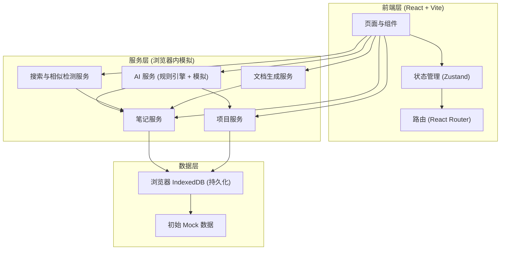
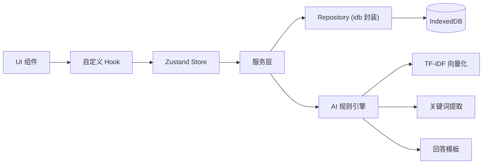
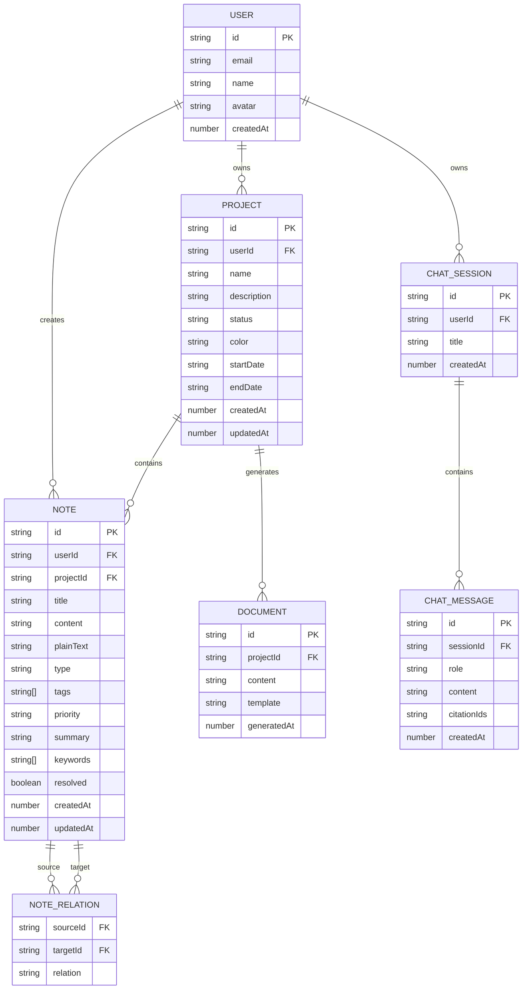

## 1. 架构设计



## 2. 技术说明

- **前端**：React@18 + tailwindcss@3 + vite
- **初始化工具**：vite-init（React + TypeScript 模板）
- **状态管理**：Zustand（轻量、与 React 18 兼容良好）
- **路由**：React Router v6
- **富文本编辑器**：基于 `@tiptap/react` 的可扩展编辑器，支持 Markdown 快捷输入
- **图标**：lucide-react
- **图表**：recharts（环形图、时间线）
- **动画**：Motion（原 Framer Motion）用于页面过渡与微交互
- **持久化**：IndexedDB（通过 `idb` 库封装），用于模拟后端数据存储
- **AI 模拟**：前端实现的轻量规则引擎（关键词匹配 + TF-IDF 相似度 + 模板化回答），无需真实 LLM 调用即可演示完整体验
- **后端**：无（本项目为前端演示，所有数据存储于浏览器本地）
- **数据库**：IndexedDB 模拟关系型存储

## 3. 路由定义

| 路由 | 用途 |
|-------|---------|
| `/login` | 登录/注册页 |
| `/` | 工作台（Dashboard），默认重定向到此 |
| `/notes` | 笔记列表页 |
| `/notes/new` | 新建笔记（进入编辑器） |
| `/notes/:id` | 编辑指定笔记 |
| `/projects` | 项目空间列表 |
| `/projects/:id` | 项目详情页 |
| `/projects/:id/document` | 生成项目说明文档（模态/独立路由） |
| `/ask` | AI 问答页 |
| `/settings` | 用户设置 |

## 4. API 定义（前端服务层接口）

```typescript
// 笔记服务
interface NoteService {
  list(filter?: NoteFilter): Promise<Note[]>;
  get(id: string): Promise<Note | null>;
  create(input: NoteInput): Promise<Note>;
  update(id: string, patch: Partial<Note>): Promise<Note>;
  delete(id: string): Promise<void>;
  search(keyword: string, semantic: boolean): Promise<Note[]>;
}

interface Note {
  id: string;
  title: string;
  content: string;        // HTML 内容
  plainText: string;      // 用于搜索/摘要
  projectId: string | null;
  type: 'keypoint' | 'description' | 'problem' | 'decision' | 'general';
  tags: string[];
  priority: 'low' | 'medium' | 'high';
  relatedNoteIds: string[];
  summary?: string;       // AI 生成摘要
  keywords?: string[];    // AI 提取关键词
  resolved?: boolean;     // 仅 type=problem 时有意义
  createdAt: number;
  updatedAt: number;
}

// 项目服务
interface ProjectService {
  list(): Promise<Project[]>;
  get(id: string): Promise<Project | null>;
  create(input: ProjectInput): Promise<Project>;
  update(id: string, patch: Partial<Project>): Promise<Project>;
  delete(id: string): Promise<void>;
  notesOf(projectId: string): Promise<Note[]>;
}

interface Project {
  id: string;
  name: string;
  description: string;
  status: 'active' | 'paused' | 'archived';
  color: string;
  startDate?: string;
  endDate?: string;
  createdAt: number;
  updatedAt: number;
}

// AI 服务
interface AIService {
  analyzeNote(content: string): {
    summary: string;
    keywords: string[];
    suggestedProjectId: string | null;
    suggestedType: Note['type'];
  };
  findSimilar(content: string, excludeId?: string): Promise<SimilarNote[]>;
  categorizeNotes(): Promise<CategorizeSuggestion[]>;
  ask(question: string, history: ChatMessage[]): Promise<AskResponse>;
  generateDocument(projectId: string, options: DocGenOptions): Promise<string>;
}

interface SimilarNote {
  note: Note;
  similarity: number; // 0-1
  matchedSegments: string[];
}

interface AskResponse {
  answer: string;
  citations: { noteId: string; snippet: string }[];
}

// 文档生成
interface DocGenOptions {
  startDate?: number;
  endDate?: number;
  sections: ('background' | 'goals' | 'decisions' | 'problems' | 'progress')[];
  template: 'standard' | 'minimal' | 'detailed';
}
```

## 5. 服务架构图



## 6. 数据模型

### 6.1 数据模型定义



### 6.2 数据定义语言（IndexedDB Object Store 等价定义）

```javascript
// IndexedDB Schema (通过 idb 库定义)
const dbSchema = {
  users: {
    keyPath: 'id',
    indexes: ['email']
  },
  projects: {
    keyPath: 'id',
    indexes: ['userId', 'status', 'updatedAt']
  },
  notes: {
    keyPath: 'id',
    indexes: ['userId', 'projectId', 'type', 'createdAt', 'updatedAt']
  },
  noteRelations: {
    keyPath: ['sourceId', 'targetId'],
    indexes: ['sourceId', 'targetId']
  },
  documents: {
    keyPath: 'id',
    indexes: ['projectId', 'generatedAt']
  },
  chatSessions: {
    keyPath: 'id',
    indexes: ['userId', 'updatedAt']
  },
  chatMessages: {
    keyPath: 'id',
    indexes: ['sessionId', 'createdAt']
  }
};

// 初始化 Mock 数据示例
const seedProjects = [
  {
    id: 'proj_atlas',
    userId: 'user_demo',
    name: 'Atlas 商城重构',
    description: '下一代电商平台核心系统重构',
    status: 'active',
    color: '#D4A24C',
    startDate: '2026-05-01',
    endDate: '2026-09-30',
    createdAt: Date.now() - 86400000 * 30,
    updatedAt: Date.now() - 3600000
  },
  {
    id: 'proj_orion',
    userId: 'user_demo',
    name: 'Orion 数据中台',
    description: '统一数据采集与指标平台',
    status: 'active',
    color: '#6FB2B2',
    startDate: '2026-04-15',
    createdAt: Date.now() - 86400000 * 60,
    updatedAt: Date.now() - 7200000
  },
  {
    id: 'proj_lyra',
    userId: 'user_demo',
    name: 'Lyra 客户增长',
    description: '私域客户增长与触达体系',
    status: 'paused',
    color: '#C8543C',
    startDate: '2026-03-01',
    createdAt: Date.now() - 86400000 * 90,
    updatedAt: Date.now() - 86400000 * 5
  }
];
```
